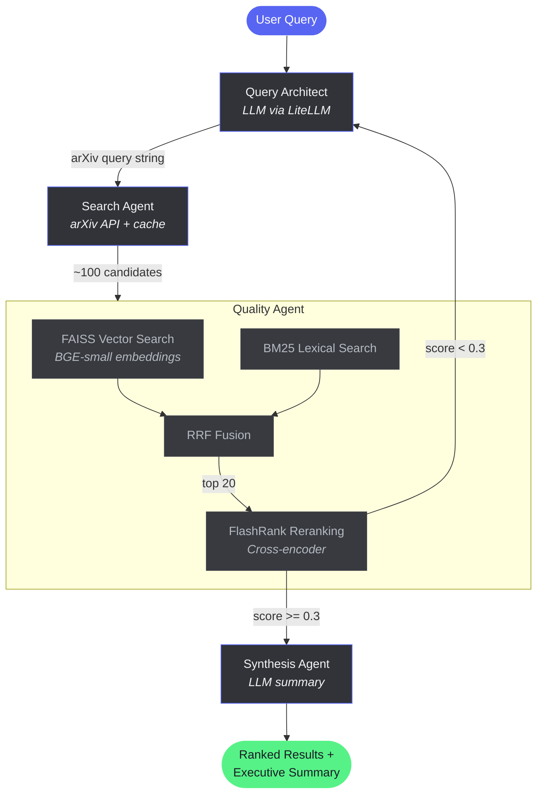

# arXiv Agent Crawler

AI-powered hybrid search engine for arXiv papers. Translates natural language research questions into precise arXiv queries, fetches candidates, and applies a local retrieval funnel to surface the most relevant papers.

**Pipeline:** User query → LLM query builder → arXiv API (100 candidates) → FAISS + BM25 → RRF fusion → FlashRank reranking → LLM synthesis

## Quick Start

### Prerequisites

- Python 3.11+
- [uv](https://docs.astral.sh/uv/) package manager
- An OpenAI API key (or any LiteLLM-supported provider)

### Setup

```bash
git clone https://github.com/rogersebastiany/arxiv-agent-crawler.git
cd arxiv-agent-crawler

# Install dependencies
uv sync --extra dev --extra desktop

# Configure API keys
cp .env.example .env
# Edit .env and set your OPENAI_API_KEY
```

### Run

**Web UI** (recommended):

```bash
uv run uvicorn src.api.main:app --reload
# Open http://localhost:8000 in your browser
```

**Desktop UI** (native Qt/KDE):

```bash
uv run python -m ui.desktop.main
```

**API only**:

```bash
# Search
curl -X POST http://localhost:8000/api/search \
  -H "Content-Type: application/json" \
  -d '{"query": "autonomous agents for CI/CD testing"}'

# Health check
curl http://localhost:8000/api/health
```

### Docker

```bash
docker compose -f docker/docker-compose.yml up
# API + Web UI at http://localhost:8000
# LangFuse dashboard at http://localhost:3000
```

## Testing

```bash
uv run pytest tests/unit/ -v              # All unit tests
uv run pytest tests/unit/test_engine.py   # Single file
uv run pytest -k "test_rrf"              # Single test by name
```

## Linting

```bash
uv run ruff check src/ tests/
uv run black --check src/ tests/
uv run black src/ tests/                  # Auto-fix
```

## Project Structure

```
src/
├── agents/          # LangGraph nodes (architect, searcher, quality, synthesizer)
├── core/            # Deterministic engine (BM25, FAISS, RRF, embeddings, reranker)
├── api/             # FastAPI server (search + saved articles + static file serving)
├── utils/           # LLM wrapper (LiteLLM + tenacity), prompt loader, observability
├── storage.py       # Saved articles (local JSON with atomic writes)
└── main.py          # LangGraph graph definition with smart broadening loop
ui/
├── web/             # Browser UI (vanilla HTML/CSS/JS, served by FastAPI)
└── desktop/         # Native Qt6 desktop app (PyQt6)
prompts/             # LLM prompt templates (YAML)
tests/
├── unit/            # pytest — deterministic logic + mocked agent tests
└── evals/           # Golden dataset for semantic evaluation
```

## Configuration

All config is via `.env` (see `.env.example`):

| Variable | Description | Default |
|---|---|---|
| `OPENAI_API_KEY` | OpenAI API key | — |
| `LITELLM_MODEL` | LLM model to use | `gpt-4o-mini` |
| `LANGFUSE_PUBLIC_KEY` | LangFuse public key (optional) | — |
| `LANGFUSE_SECRET_KEY` | LangFuse secret key (optional) | — |
| `LANGFUSE_HOST` | LangFuse server URL | `http://localhost:3000` |

## How It Works



1. **Query Architect** — LLM translates your question into arXiv search syntax with field prefixes, boolean operators, and category filters
2. **Search Agent** — Fetches up to 100 candidate papers from arXiv API (with caching and retry)
3. **Quality Agent** — Runs hybrid search (FAISS semantic + BM25 lexical → RRF fusion), then FlashRank cross-encoder reranking. If the top score is below 0.3, it triggers a broadening loop back to the Query Architect (max 3 retries)
4. **Synthesis Agent** — LLM generates an executive summary of the top 5 papers

## Observability

Set `LANGFUSE_PUBLIC_KEY` and `LANGFUSE_SECRET_KEY` in `.env` to enable automatic tracing of all LLM calls. Uses LiteLLM's native LangFuse callback — every completion is traced with input/output, latency, model, and token usage.
